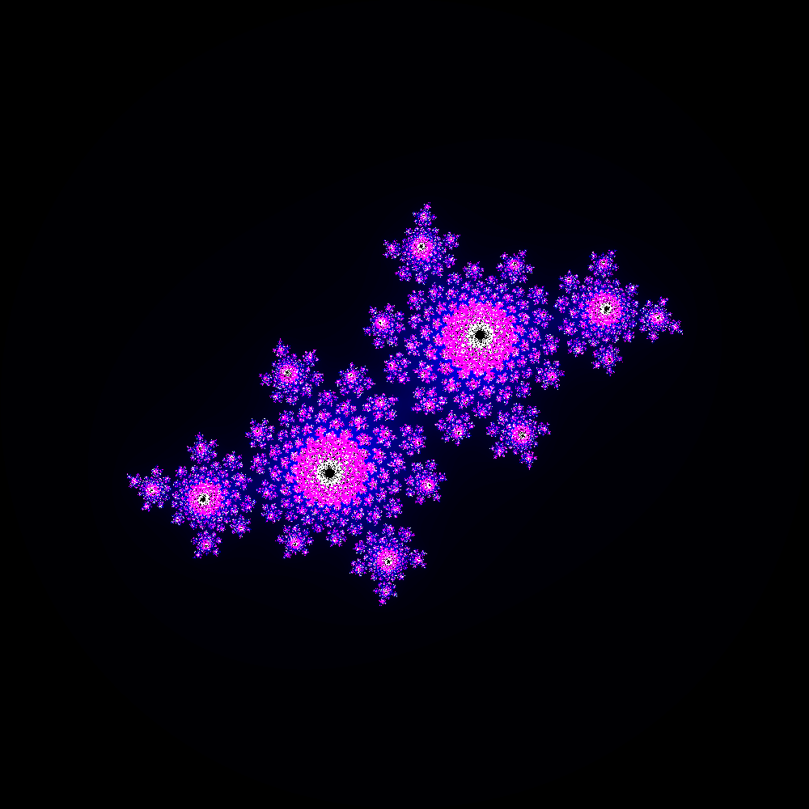

# EPCC Summer School Application
This repository contains some examples of projects I have carried out at university this academic year, as well as a personal project I completed recently.

## Normals of an Ellipse
From the project module taken by level 3 students who are progressing to level 4. I investigated a numerical solution to the problem of how many normals of an ellipse pass through a given point in the plane.

## Sleep-Wake Dynamics
A group project undertaken as part of *Modelling and Simulation* in which we numerically solved a system of coupled differential equations which model human sleep-wake dynamics, then carried out parametric analysis to investigate the effects of caffeine on sleep.

## Topological Data Analysis
A project in which I investigated the effects of the UK's Brexit referendum on the US stock market, using data from the DJIA index and persistent homology.

## Mandelbrot and Julia Sets
Written in [Processing](https://www.processing.org), this generates the Mandelbrot set, and clicking anywhere on the set generates the corresponding Julia set in a separate window. Some examples are shown below.

